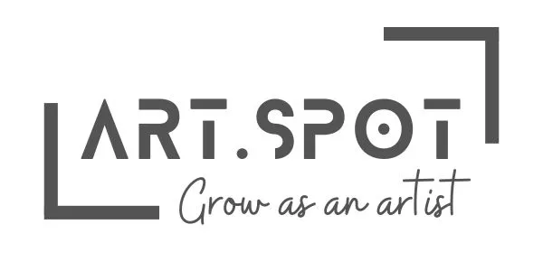
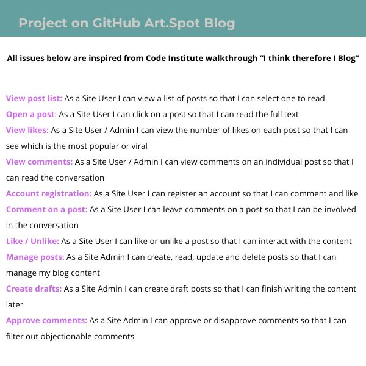
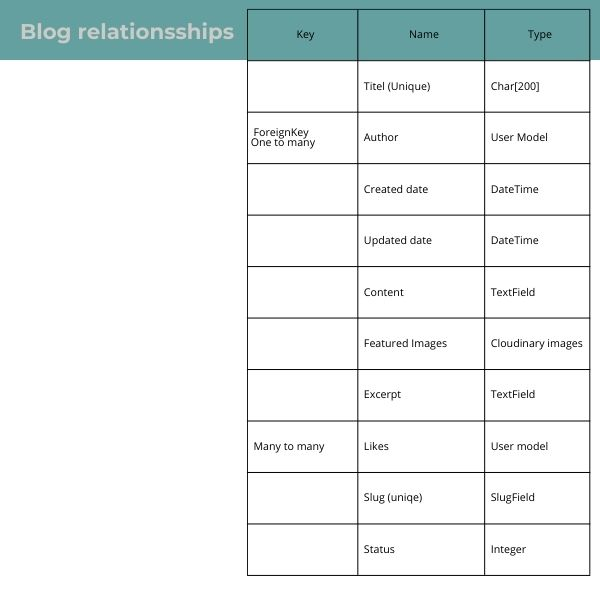

Welcome ArtSpot,

Artspot is a community for artists who want to grow in their artistry. Here you can take part in live events, courses and read blogs.

![Site across devices] ADD: Site across devices: img 

## Table of Contents
+ [UX](#ux "UX")
  + [Site Purpose](#site-purpose "Site Purpose")
  + [Site Goal](#site-goal "Site Goal")
  + [Audience](#audience "Audience")
  + [Communication](#communication "Communication")
  + [Current User Goals](#current-user-goals "Current User Goals")
  + [New User Goals](#new-user-goals "New User Goals")
+ [Design](#design "Design")
  +[Wireframes](#wireframes "wireframes")
  + [Colour Scheme](#colour-scheme "Colour Scheme")
  + [Typography](#typography "Typography")
  + [Imagery](#imagery "Imagery")
+ [Features](#features "Features")
  + [Existing Features](#existing-features "Existing Features")
  + [Projects GitHub](#Github-projects "Projects GitHub")
+ [Testing](#testing "Testing")
  + [Validator Testing](#validator-testing "Validator Testing")
  + [Unfixed Bugs](#unfixed-bugs "Unfixed Bugs")
+ [Technologies Used](#technologies-used "Technologies Used")
  + [Main Languages Used](#main-languages-used "Main Languages Used")
  + [Frameworks, Libraries & Programs Used](#frameworks-libraries-programs-used "Frameworks, Libraries & Programs Used")
+ [Deployment](#deployment "Deployment")
+ [Credits](#credits "Credits")
  + [Content](#content "Content")
  + [Media](#media "Media")

  ## UX
  ### Site Purpose:
  ### Site Goal:
  ### Audience:
  ### Communication:
  ### New User Goals:
  ## DESIGN 
  ### Wireframes:
  
   ### Colour Scheme:
 ![Colors]ADD:IMG
  ### Typography:
  

  ### Imagery:
  ## FEATURES 
  ### Existing Features:
  ### Projects Github
  
  
  #### Landing Page:
  #### Page Title:
  ## TESTING 
  ### Validator Testing
  ## TECHNOLOGIES USED
  ### Main Languages Used
- Python
- HTML5
- CSS
- Javascript
### Frameworks, Libraries & Programs Used:

- https://www.devhandbook.com/django/user-profile/
  ## DEPLOYMENTS
  
The site is created in Gitpod with a template from CodeInstitute.
The regular commits and pushes were sent from GitPod back to the repo on GitHub.

In the GitHub repository, navigate to the Settings tab
From the source section drop-down menu, select the Main Branch
Once the main branch has been selected, the page will be automatically refreshed with a detailed ribbon display to indicate the successful deployment.
  ## CREDITS  

Form styleing
https://pypi.org/project/django-widget-tweaks/
How to Easily Style Your Django Form Fields With Django Widget Tweaks (https://www.youtube.com/watch?v=ynToND_xOAM)

REMOVE BEFORE SUBMITTING
`python3 -m http.server`
 `python3 manage.py runserver'